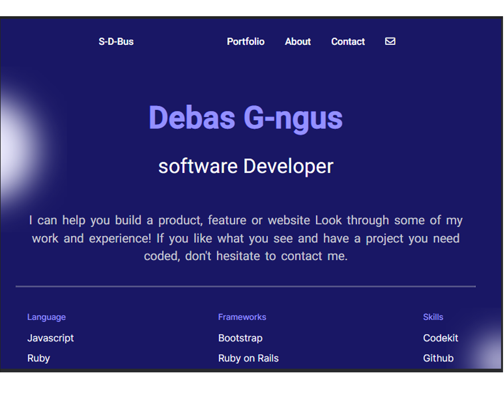

# My-portfolio: Desktop Version

>This milestone is a continuation of the previous milestones. In this project, I was done a Desktop-Version with different screen sizes in a responsively way by using media queries as well as UX form with HTML validations, implement the importance of UX and the finished desktop version of my-portfo
The aim of this project to parse a Figma design to create an awesome UI using flexbox and grid layout media queries with the standard setup 
while doing the best practices (Linter, Github Flow, Professional commits, pull request and documentation)

### Built With

- HTML5
- CSS3

### Live Demo

[Visit the Live Demo](https://debas-31.github.io/my-portfolio/)

### Install

To get a local copy up and running follow these simple example steps.
- Open terminal
- Clone this project by the command `git clone URL/repository_name.git`
- `cd repository_name` folder
- Open `index.html` in your local browser or using Live Server in Visual Studio Code.
### Authors

👤 **Debas Gebreslasie**

- [GitHub](https://github.com/Debas-31)
- [Twitter](https://twitter.com/DEBSH76956492)
- [LinkedIn](https://www.linkedin.com/in/debas-gebrengus-5256a2159/)

### 🤝 Contributing

Contributions, issues, and feature requests are welcome!

Feel free to check the [issues page](https://github.com/Debas-31/my-portfolio/issues).

### Show your support

Give a ⭐️ if you like this project!

### Acknowledgments
- Microverse and Figma

## 📝 License

This project is [MIT](https://github.com/Debas-31/my-portfolio/blob/main/MIT.md) licensed.