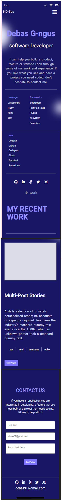

# My-portfolio: mobile version

>This milestone-3 is a continuation of the previous milestones.I create a contact form with html validations, implement importance of UX and the finished mobile version of my-portfolio.  
The aim of this project to parse a Figma design to create an awesome UI using flexbox layout with the standard setup 
while doing the best practices (Linter, Github Flow, Professional commits, pull request and documentation)

### Built With

- HTML5
- CSS3

### Live Demo

[Visit the Live Demo](https://debas-31.github.io/my-portfolio/)

### Install

To get a local copy up and running follow these simple example steps.
- Open terminal
- Clone this project by the command `git clone URL/repository_name.git`
- `cd repository_name` folder
- Open `index.html` in your local browser or using Live Server in Visual Studio Code.
### Authors

👤 **Debas Gebreslasie**

- [GitHub](https://github.com/Debas-31)
- [Twitter](https://twitter.com/DEBSH76956492)
- [LinkedIn](https://www.linkedin.com/in/debas-gebrengus-5256a2159/)

### 🤝 Contributing

Contributions, issues, and feature requests are welcome!

Feel free to check the [issues page](https://github.com/Debas-31/my-portfolio/issues).

### Show your support

Give a ⭐️ if you like this project!

### Acknowledgments
- Microverse

## 📝 License

This project is [MIT](https://github.com/Debas-31/my-portfolio/blob/milestone-1/MIT.md) licensed.
