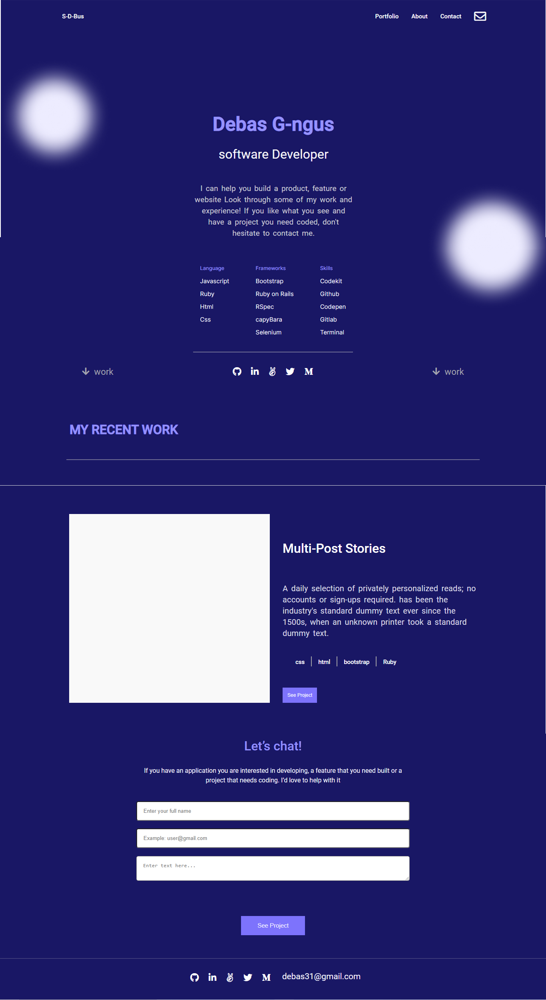

# My-portfolio: Desktop Version

>This milestone is a continuation of the previous milestones. In this project, I use a GitHub Pages to deploy my-portfolio website.

### Built With

- HTML5
- CSS3

### Live Demo

[Visit the Live Demo](https://debas-31.github.io/my-portfolio/)

### Install

To get a local copy up and running follow these simple example steps.
- Open terminal
- Clone this project by the command `git clone URL/repository_name.git`
- `cd repository_name` folder
- Open `index.html` in your local browser or using Live Server in Visual Studio Code.
### Authors

👤 **Debas Gebreslasie**

- [GitHub](https://github.com/Debas-31)
- [Twitter](https://twitter.com/DEBSH76956492)
- [LinkedIn](https://www.linkedin.com/in/debas-gebrengus-5256a2159/)

### 🤝 Contributing

Contributions, issues, and feature requests are welcome!

Feel free to check the [issues page](https://github.com/Debas-31/my-portfolio/issues).

### Show your support

Give a ⭐️ if you like this project!

### Acknowledgments
- GitHub 

## 📝 License

This project is [MIT](https://github.com/Debas-31/my-portfolio/blob/main/MIT.md) licensed.